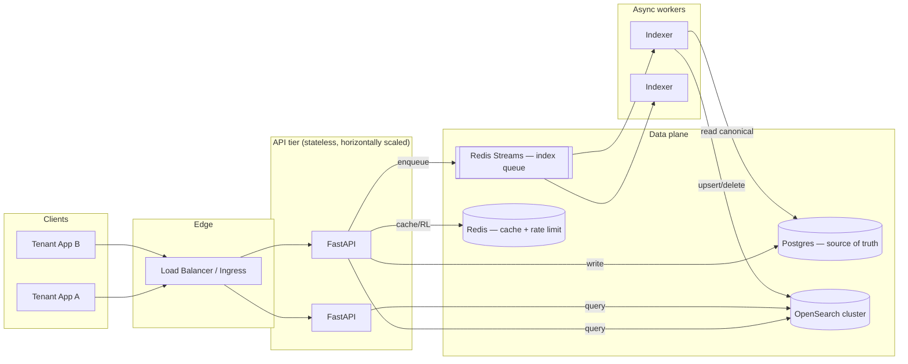

# Architecture — Distributed Document Search Service

## 1. High-level architecture



Key properties:

- **Stateless API tier** — scales horizontally behind an L7 load balancer.
- **Postgres as source of truth** for document content + tenant registry; OpenSearch is a materialized projection.
- **Write path is asynchronous** — API returns 202 once durably written to Postgres and enqueued to Redis Streams; indexers update OpenSearch.
- **Read path short-circuits on Redis cache** for hot queries, then falls through to OpenSearch.

## 2. Data flow

### Indexing
```
Client → POST /documents
        → API validates + writes row to Postgres (durable commit)
        → API XADDs {op: upsert, id, tenant_id} to Redis Stream
        → API returns 202 {id, status: "accepted"}

Indexer (consumer group)
        ← XREADGROUP batch
        → fetches canonical row from Postgres
        → indexes into OpenSearch with routing=tenant_id
        → XACK
```

Delete is the same, with op=`delete` and a soft-delete on Postgres (`deleted_at`).

### Search
```
Client → GET /search?q=… (X-Tenant-ID)
       → middleware: tenant auth + token-bucket rate limit
       → cache key sha1(tenant|q|size|offset|sorted_tags|facets_flag)
       → hit  → respond + X-Cache: hit
       → miss → OpenSearch multi_match with mandatory tenant_id filter + routing
              → populate hot cache (TTL 30s) and stale cache (TTL 30min)
              → respond + X-Cache: miss
       → OpenSearch error → serve stale cache + X-Cache: stale-while-error
                          → no stale entry → 503 search_unavailable
```

## 3. Storage strategy

| Component | Choice | Why |
|---|---|---|
| Full-text search | **OpenSearch** (ES-compatible, open license) | Purpose-built inverted index, BM25 relevance, highlighting, fuzzy search, proven at 10M+ docs. Elasticsearch's licensing pushed the ecosystem to OpenSearch. |
| Source of truth | **Postgres** | ACID writes, simple tenant model, JSONB for flexible metadata, cheap to operate. Search engines are opinion-y projections — we never want them to be the only copy. |
| Cache + rate limit | **Redis** | <1ms latency, TTL primitives, atomic Lua scripts for counters, single-purpose infrastructure. |
| Async queue | **Redis Streams** | Consumer groups give at-least-once delivery with XACK / XPENDING, no extra broker to run. Swap for Kafka when throughput > 50k msg/s or when we need multi-day retention. |

## 4. API contract

```
POST   /documents              202  { id, status }
GET    /documents/{id}         200  { id, tenant_id, title, body, tags, metadata, timestamps }
DELETE /documents/{id}         202  { id, status: "accepted" }
GET    /search?q=…&size=&offset=&tag=…&facets=true
                               200  { took_ms, total, hits[], cache, facets? }
GET    /health                 200  { status, dependencies{ postgres, redis, opensearch } }
```

Search supports tag filtering (repeatable `tag=` query param — AND semantics, every tag must be present on the document) and faceted aggregation (`facets=true` returns a tag-bucket histogram). All non-public endpoints require `X-Tenant-ID`. Responses use JSON; errors follow `{error, detail}`. Search responses carry `X-Cache: hit | miss | stale-while-error`. Rate-limited responses additionally carry `X-RateLimit-Limit` / `X-RateLimit-Remaining`.

## 5. Consistency model

- **Writes**: strong consistency in Postgres (the record of truth).
- **Search**: eventual consistency. P50 visibility lag ≈ indexer batch interval + OpenSearch refresh (default 1s). Clients can issue `GET /documents/{id}` immediately for read-your-write semantics on a specific document; only the full-text search is eventual.
- **Cache**: TTL-based invalidation; bounded staleness = `search_cache_ttl_seconds` (default 30s). Trade-off: no active bust on writes keeps the API simple; 30s staleness is acceptable for search UIs but we can add targeted invalidation for name-collision queries if needed.

## 6. Caching strategy

| Layer | What | TTL | Keyed on |
|---|---|---|---|
| L1 hot — Redis query cache | `/search` response body | 30s | `sc:{tenant_id}:sha1(tenant\|q\|size\|offset\|sorted_tags\|facets_flag)` |
| L1 stale — graceful-degrade copy | same body, served on OS failure | 30 min | same key + `:stale` suffix |
| L2 — OpenSearch request cache | repeated aggs / filters | default | cluster-managed |
| L3 — page cache | OS-level fs cache on shards | implicit | OS workload |

We deliberately **cache per-tenant** — never share cache entries across tenants. The key prefix includes `tenant_id` so key collision is structurally impossible. The stale layer exists for the failure mode in §5: if OpenSearch errors out, the route returns the stale body with `X-Cache: stale-while-error` instead of failing the request.

## 7. Message queue usage

Redis Streams carries:
- `docs.index.v1` — upsert/delete events. Consumer group `indexers`, consumers horizontally scale.
- MAXLEN ≈ 100k with approximate trimming keeps the stream bounded.

Failure handling: unacked entries stay in XPENDING. The indexer's main loop runs `XAUTOCLAIM` against entries idle > 30s and re-processes them. Each retry consults `XPENDING` for the delivery count; once `times_delivered ≥ indexer_max_deliveries` (default 5) the entry is XADDed to `docs.index.dlq` and XACKed off the main stream so a poison message cannot block the partition. The DLQ is the alerting surface — a healthy system has zero entries here.

## 8. Multi-tenancy

- **Auth**: `X-Tenant-ID` header validated against `tenants` table in Postgres. (Prototype shortcut — production uses a signed JWT; see production-readiness.md.)
- **Logical isolation**: every OpenSearch query contains a mandatory `term` filter on `tenant_id`, enforced server-side — the API does not accept a tenant filter from the client.
- **Shard affinity**: `routing=tenant_id` co-locates a tenant's docs on one shard, keeping per-query fan-out tight.
- **Quotas**: per-tenant rate limit (default 50 rps, overrideable in the `tenants` row) via a Redis-backed **token bucket** (atomic Lua, server-side TIME, smooth refill). Capacity = `rps × burst_multiplier`; refill rate = `rps`. The response carries `X-RateLimit-Limit` and `X-RateLimit-Remaining`.
- **Upgrade path**: for compliance-tier tenants we migrate to index-per-tenant behind an alias — the code only needs to swap a resolver.

## 9. Bounded timeouts

No code path can hang on a wedged backend. OpenSearch client `timeout=0.7s` on the API and `5s` on the indexer. Postgres `command_timeout=0.5s` on the API, `2s` on the indexer. Redis `socket_timeout=0.1s` on the API. The `/search` route catches OpenSearch exceptions and falls back to the stale cache (see §6); if no stale entry exists, returns 503.

## 10. Trade-offs (explicit)

| Decision | Upside | Downside | Mitigation |
|---|---|---|---|
| Async indexing | Fast write path; indexer failures don't break writes | Search is eventually consistent | Read-your-write via `GET /documents/{id}` |
| Single shared OS index | Cheap, one index to operate | Noisy-neighbor risk; weaker blast-radius control | Per-tenant shard routing; escape hatch to index-per-tenant |
| Redis Streams | No extra broker, at-least-once | Lower throughput ceiling than Kafka; no infinite retention | Migrate to Kafka at ~50k msg/s |
| Header-based tenancy | Simple prototype | Trivially spoofable | JWT in production (see prod-readiness) |
| Token-bucket rate limit | Smooth refill, per-tenant burst, returns remaining tokens | Single-Redis hot key per tenant | Shard Redis when a tenant's traffic dominates; pre-decrement at edge for very strict SLAs |
